# GetSome

**One video browser for several sites — feeds, categories and search, played by the system player.**


A multiplatform SwiftUI app built on Apple's *Destination Video* sample. It keeps
that project's shell — tab navigation, hero banner, card layouts, the
`AVPlayerViewController` stack, Picture in Picture, SharePlay, and the visionOS
immersive environment — and replaces its bundled catalog with live content from
third-party sites.

---

## Sites

| Site | Feeds | Categories | Playback |
| :--- | :--- | :--- | :--- |
| **mat6tube** | popular · newest · explore · watching now · 3 charts | — *(publishes no index)* | progressive MP4 |
| **XVideos** | popular · newest · verified | ~2,000 tags | HLS · 250p–1080p |
| **MissAV** | popular · newest · releases · uncensored · 2 subtitle feeds · 3 charts | 37 genres | HLS · 360p–1080p |
| **Pornhub** | hot · newest · 3 charts | — | adaptive HLS · *region-dependent* |

> [!NOTE]
> **Pornhub is unavailable in some countries**, and the app now says so instead of
> pretending otherwise. Where age-verification law applies, every browse route
> answers `302 → /`. `URLSession` follows that, so each feed used to return a
> healthy `200` with 24 parsed videos — the home page, shown five times under
> different names, with neither `badResponse` nor `noResults` able to notice.
>
> `ContentClient` now treats *redirected to the site root* as its own failure and
> reports it. Where the site serves normally, the source works normally; the check
> only fires on the redirect. It is deliberately narrow — a redirect that merely
> adds a trailing slash, resolves to a different page, or leaves the host is not
> this — so it can't break a working site.

**MissAV publishes in 11 languages**, and the source follows the device rather than
pinning English, so titles and genre names usually arrive already translated — see
`MissAVSource.localePath`.

Adding one is **a single file plus one line** in `ContentSources.all`. Nothing
above that layer changes — the merged shelves, the site picker and per-source
attribution all appear on their own.

## One catalog

The app presents these four as **one catalog**, not as four sites to choose
between. Each site's listings are tagged with the `FeedKind` they *are* rather
than the word that site uses — mat6tube's "Popular" and Pornhub's "Hot" are the
same idea — and every kind becomes a single collection drawing from whichever
sites publish it.

```
Popular ─┬─ mat6tube  /popular     page n ─┐
         ├─ Pornhub   /video?o=ht  page n ─┼─ interleaved round-robin
         ├─ XVideos   /            page n ─┤   primary site first
         └─ MissAV    /            page n ─┘
```

`ContentClient` fetches page *n* from every member concurrently and interleaves the
results, so a shelf reads as one collection rather than four catalogs end to end.
A member that fails is dropped rather than emptying the shelf; the request fails
only when every member did.

A listing only one site publishes — MissAV's subtitled feeds, XVideos' Verified —
is merged too, with a single member. That isn't a special case in the code: the
card is named for its contents either way, and the day a second site adds the same
listing it fills in with no further change.

| | where the site is still visible |
| :--- | :--- |
| **Feed screen** | credits the sites actually behind it, and filters to one |
| **Browse** | a site picker, for browsing one catalog deliberately |
| **Cards** | each video's own site, in its detail screen |

> [!NOTE]
> Aggregating multiplies request volume by the number of sites — every shelf is a
> fan-out. That is the reason for the snapshot and poster caches, and for the
> energy rules in [CONTRIBUTING.md](CONTRIBUTING.md).

### Recognizing the same video twice

Sites republish each other, so a gathered page arrives holding one scene two or
three times under titles nobody wrote the same way. Nothing links those copies —
each site issues its own identifier — so `VideoMatcher` compares what every
listing does publish: a title and a running time.

| Signal | How it's used |
| :--- | :--- |
| **Running time** | required, always. A few seconds' tolerance, more on a long film |
| **Studio code** | `MXGS-1440` and `mxgs1440` are one code, and settle it outright |
| **Title words** | junk and stopwords dropped, then compared by Sørensen–Dice |
| **Same site** | never compared — a site's own listing is authoritative |

The two mistakes are not equally bad. A missed duplicate leaves a feed as it is;
a **wrong** match hides a video and says nothing about it. So a title alone never
matches, running times must agree, and a caption made only of tag words — which
sites produce constantly — is treated as carrying no information at all.

The copy that survives is the one from the site leading the order, and it takes
whatever the others knew that it didn't. It also remembers their identities, which
is what lets playback fall back: a site that has pulled a video, blocked the
region or simply broken is answered by asking the next site holding the same one.

> [!TIP]
> `Tools/MatcherCheck/run.sh` checks the matcher against known pairs without
> building the app — useful precisely when the live sites can't verify anything,
> which is most of the time two of them are blocked.

**Still not merged:** ordering is positional fairness rather than ranking, and
keyword search across sites is literal text, so a term only matches where that
word is the site's own vocabulary.

### Being a polite client

Aggregating changed the shape of this app's traffic: browsing one site meant one
request per screen, while a merged shelf means one *per site*, several shelves at
a time. Sites read bursts as robots. Requests to a single site are spaced, and a
site answering `403` or `429` is rested for two minutes rather than being asked
nine more times by the rest of the fan-out.

> [!NOTE]
> **A challenge page is where this app stops.** When a site answers with one, the
> app reports the site as refusing and waits. It does not attempt to solve it.

## Architecture

```mermaid
flowchart TD
    subgraph ui [Views]
        A["WatchNow · Browse · Search<br/>Saved · Categories · Detail"]
    end
    subgraph state [State]
        B["FeedStore<br/><i>paging, per-feed state</i>"]
        S["FeedSnapshotStore<br/><i>page 1 on disk</i>"]
        T["TranslationStore<br/><i>translation of site text</i>"]
    end
    subgraph net [Networking]
        C["ContentClient<br/><i>requests · caching · stream choice<br/>cross-site merge</i>"]
        L["RequestLog<br/><i>diagnostics</i>"]
    end
    subgraph src [ContentSource protocol]
        D[Mat6TubeSource]
        E[XVideosSource]
        F[MissAVSource]
        G[PornhubSource]
    end

    A --> B
    A --> T
    B <--> S
    B --> C
    C --> L
    C --> D & E & F & G

    style src fill:#0d1117,stroke:#f05138,stroke-width:2px
    style C fill:#0d1117,stroke:#1f6feb,stroke-width:2px
```



`ContentClient` knows how to make a request and cache a result; it holds no
knowledge of any particular site. Everything site-specific lives behind
`ContentSource` — the highlighted layer is the only one that grows.

> **Adding a site?** Read **[Docs/AddingASource.md](Docs/AddingASource.md)** — the
> skeleton, a six-question reconnaissance checklist, and the traps. The plumbing is
> a template; the reconnaissance is the real work.

## Repository layout

```
GetSome/
├── Model/
│   ├── Sources/          ContentSource, the registry, per-site implementations,
│   │                     HTMLScanner and HLSManifest helpers
│   ├── Networking/       ContentClient, RequestLog, poster disk cache,
│   │                     the system and fallback translators
│   ├── Data/             Video, VideoID, SavedVideo, WatchedVideo
│   ├── FeedStore         paging, per-feed state, merged fan-out
│   ├── FeedSnapshotStore last page 1 of each feed, for an instant launch
│   └── TranslationStore  translation of site text
├── Views/                screens and cards, including Keywords
├── Player/               PlayerModel, Up Next, the platform player wrappers
└── SharePlay/            group watching
```

---

## How it works

<details>
<summary><b>Adding a site</b> — one conformance, eight members</summary>

<br>

```swift
struct ExampleSource: ContentSource {
    let id = "example"                    // stable — it appears in saved data
    let displayName = "Example"
    let homeURL = URL(string: "https://example.com/")!

    var feeds: [Feed] {
        // `kind` is what merges this listing with the other sites' version of it.
        [makeFeed("trending", name: "Trending", description: "…", icon: "flame",
                  kind: .popular),
         makeFeed("top", name: "Top", description: "…", icon: "crown",
                  group: .chart, kind: .topRated)]
    }

    func listingURL(for feed: Feed, page: Int) -> URL? { … }
    func searchURL(query: String, page: Int) -> URL? { … }
    func watchURL(forItem itemID: String) -> URL { … }
    func videos(inListing response: SourceResponse) throws -> [Video] { … }
    func details(inWatchPage response: SourceResponse, itemID: String) throws -> VideoDetails { … }
}
```

Defaults cover the rest: a browser-shaped `URLRequest`, resolution selection per
platform, and which feed the Watch Now screen leads with. A source receives raw
`Data`, so a JSON API is as easy to wrap as a page of markup — `HTMLScanner` is
only there for the latter.

</details>

<details>
<summary><b>Video identity</b> — a stored pair, never an encoded string</summary>

<br>

```swift
struct VideoID: Hashable, Sendable, Codable {
    let sourceID: String
    let itemID: String
}
```

Two sites can, and eventually will, use the same identifier for different videos,
so neither half identifies a video alone. Keeping the halves separate means no
separator character is load-bearing — a site whose ids contain `/`, `|` or spaces
can't break parsing. `description` (`mat6tube/-13001002_456239834`) exists only for
logs and for system interfaces that demand a string; nothing parses it back.

`SavedVideo` stores the two fields and enforces
`#Unique<SavedVideo>([\.sourceID, \.itemID])`, so renaming a source is a field
update rather than a string rewrite.

Three consequences:

- **Normalize ids at the source.** `normalizedItemID(_:)` collapses the variants a
  site hands out — trailing slashes, tracking queries, fragments — so one video
  can't be saved twice.
- **Renames are survivable.** List an old identifier in `previousIDs` and the
  registry keeps resolving it.
- **Dropping a source doesn't corrupt anything.** `Video.source` is optional and
  `isAvailable` is false; such videos stay in the library, marked, unplayable.

</details>

<details>
<summary><b>Categories</b> — feeds discovered at runtime</summary>

<br>

A category is just a `Feed` discovered at runtime rather than declared in code, so
the store, the feed screen and paging treat it exactly like a built-in feed. A
source opts in by overriding `categoriesURL()` and `categories(in:)`; one that
publishes no index overrides nothing and the app offers none for it.

Because a site can publish thousands, categories are excluded from sidebar tab
generation — see `FeedGroup.navigableGroups`.

</details>

<details>
<summary><b>Resolving playback</b> — second requests and manifest expansion</summary>

<br>

Most sites publish their media URL on the watch page. Some don't: xvideos serves
only a 360p MP4 inline and returns the real set from an RPC its own player calls.
`streamsURL(forItem:)` and `streams(in:)` cover that second request.

`ContentClient` then expands any master HLS playlist into one source per rendition,
so every site ends up with comparable heights, the Maximum Quality setting means
the same thing everywhere, and the app can report what it is playing. That expansion
applies to a manifest found on the watch page just as much as to one fetched from a
second endpoint — missav publishes its master directly, and gets the same treatment.

Obfuscation is worth a second look before working around it. missav assembles its
media URL inside a `p,a,c,k,e,d` script, but the identifier that URL needs also sits
in plain text a few lines away, in the seek-thumbnail URLs. Reading it there is both
simpler and steadier than unpacking anything.

Media URLs are signed and short-lived, so a stream is resolved at the moment of
playback rather than stored.

**The player is a separate client.** It fetches manifests and segments on its own
networking stack, which sends none of the headers `request(for:)` sets — so a CDN
that wants a referer answers 403 there while every app request succeeds. That fails
late and misleadingly: the stream resolves, the URL is correct, and the video simply
refuses to start. `playbackHeaders(for:)` reuses each source's own headers for media,
and defaults to exactly what its pages send.

</details>

<details>
<summary><b>Reading a site</b> — how mat6tube is parsed</summary>

<br>

That site publishes no API, so its source requests the same pages a browser
requests and reads the metadata out of the markup. Listing pages yield a title,
poster, duration, view count and HD flag per video. A watch page yields playback
sources, upload date, keywords and related videos.

Because this depends on the site's page structure, a redesign there breaks
parsing — and `Mat6TubeSource` is the only file that needs fixing.

</details>

<details>
<summary><b>Translation</b> — online, opt-in</summary>

<br>

Sites publish titles in whatever language a video was uploaded in.
`TranslationStore` translates them into the device's language. It is **off until
asked for**, because turning it on can send what you're browsing to a third party.

**On device first.** `SystemTranslator` handles any language already installed on
the phone, and only what it can't handle goes to Google. It never triggers a
download — a language pack the device doesn't already have is treated as
unavailable rather than fetched, because storage spent per language is storage the
person didn't ask to spend.

**Titles only.** Keywords are deliberately *not* translated. They're search terms
of art rather than prose: given a bare tag, machine translation turns "fishnet"
into fishing equipment, and a chip has to say what tapping it will search for —
which is the word the site published.

- Views call `translator.text(for:)`, which answers immediately with the original
  and queues a miss. The queue is `@ObservationIgnored`, so queueing from inside a
  view's body doesn't invalidate the view that's drawing.
- Misses are grouped by detected language (`NLLanguageRecognizer`, weighted by a
  prior — without one it reads Russian titles as Kazakh with full confidence, and
  the group then goes out labelled as the wrong language).
- Each group becomes one request of up to 24 strings. `GoogleTranslator` joins them
  with newlines and splits the reply back apart.
- Results land in one write per batch — a page of cards redraws once rather than
  once per title — and persist to Application Support, capped.

**Detection stays on device**, and that isn't only a performance choice: text
already in the device's language is dropped before any request, so it is never
sent anywhere.

**Why batches must not misalign.** Results are paired back to originals by index,
so a reply with the wrong number of lines would caption videos with each other's
titles. Two things guard it: newlines are stripped from every string on the way out
(a title containing one would come back as two lines), and a reply whose line count
doesn't match the request is thrown away rather than used.

**The service is a scraped endpoint, not an API.** `translate_a` is what Google's
own web widget calls — no key, no account, which is why it's here: every free
alternative either requires a key now or has gone offline. It can change shape or
start refusing without notice, so it sits behind a `TranslationService` protocol
and swapping it is one new type. Rate limiting is treated as temporary — the batch
goes back in the queue rather than being abandoned.

**The service is a fallback, not the path.** `FallbackTranslator` tries
`SystemTranslator` first and only reaches for Google when the device can't do the
work itself. Everything above — batching, alignment, persistence — applies to
whichever one answers.

</details>

<details>
<summary><b>Profile, storage and diagnostics</b></summary>

<br>

`ProfileView` is reached from the profile button — a toolbar item on iOS and macOS,
the expanding hover button over Watch Now on visionOS, and a tab on tvOS, which has
no navigation bar to hold a button. There are no accounts.

| Section | What it does |
| :--- | :--- |
| **Sites** | which source Watch Now leads with |
| **Playback** | the resolution ceiling, read by `preferredStream(from:)` |
| **Language** | translation on/off, what stays on device, status |
| **Storage** | saved count, export and import, remove all, clear caches |
| **Privacy** | Face ID lock, and a cover over the app switcher |
| **Diagnostics** | recent requests, and export the page a parser failed on |

Saved videos live in SwiftData (`SavedVideo`), each holding its own copy of the
card metadata plus its source, so the Saved tab works without refetching.

**Diagnostics matter here** because a scraper rarely fails loudly — a site returns
a healthy 200 and the parser recognises nothing. A first page that parses to zero
throws `ContentError.noResults` rather than showing an empty feed, and the parsed
count is the health signal:

| | meaning |
| :--- | :--- |
| `HTTP 200 · 475 ko · 24 parsed` | healthy |
| `HTTP 200 · 475 ko · 0 parsed` | markup drift |
| `HTTP 403 · 0 parsed` | blocked, or missing a header |

</details>

---

## Languages

The interface ships in **ten languages** — English, French, German, Spanish,
Portuguese, Italian, Russian, Japanese, Korean, Hindi and Simplified Chinese —
held in one `Localizable.xcstrings`.

That is separate from the translation feature, which translates *site* text
(video titles and keywords) and is off by default. This is the app's own chrome,
and it needs no network and no setting.

> [!TIP]
> Fifteen strings carry format specifiers. A translation that drops or reorders
> `%@` and `%lld` crashes at runtime rather than merely reading badly, so check
> the specifier sequence against the source string before adding a language.

## Requirements

**iOS 26 · macOS 26 · tvOS 26 · visionOS 26.** Build all four before pushing shared
code — see [CONTRIBUTING.md](CONTRIBUTING.md) for the loop and the platform traps.

> [!NOTE]
> Translation behaves the same on all four platforms and works in the Simulator.
> It previously used Apple's Translation framework, which is unavailable on tvOS
> and visionOS and refuses to run on simulated devices at all.

> [!IMPORTANT]
> Translation is the one feature that sends anything off the device. It is **off
> until switched on**, and text already in the device's language is never sent.

## Content and provenance

The sites this app browses serve **adult material**. It shows an age confirmation on
first launch and loads nothing until confirmed. There is no App Store distribution
path — build and run it on your own devices.

The app stores no media and redistributes none: playback streams directly from each
site using its own signed, short-lived URLs. Tokens are passed through unmodified,
exactly as each site's own player uses them.

See **[NOTICE.md](NOTICE.md)** for Apple's provenance, the licence that governs the
inherited code, and the boundaries kept during development.
