# GetSome

**One video browser for several sites — feeds, categories and search, played by the system player.**


A multiplatform SwiftUI app built on Apple's *Destination Video* sample. It keeps
that project's shell — tab navigation, hero banner, card layouts, the
`AVPlayerViewController` stack, Picture in Picture, SharePlay, and the visionOS
immersive environment — and replaces its bundled catalog with live content from
third-party sites.

---

## Sites

| Site | Feeds | Categories | Playback |
| :--- | :--- | :--- | :--- |
| **mat6tube** | popular · newest · explore · watching now · 3 charts | — *(publishes no index)* | progressive MP4 |
| **XVideos** | popular · newest · verified | ~2,000 tags | HLS · 250p–1080p |
| **MissAV** | popular · newest · releases · uncensored · 2 subtitle feeds · 3 charts | 37 genres | HLS · 360p–1080p |
| **Pornhub** | hot · newest · 3 charts | — | ⚠️ **currently unavailable** |

> [!WARNING]
> **Pornhub stopped serving this client.** Every browse route (`/video?o=…`,
> `/categories`, search) answers `302 → /`, and watch pages return 200 with no
> manifests. A full browser session with age cookies behaves identically, so this
> is age assurance at the account level rather than markup drift — the outcome
> [NOTICE.md](NOTICE.md) describes for a site that adopts real age verification.

**MissAV publishes in 11 languages**, and the source follows the device rather than
pinning English, so titles and genre names usually arrive already translated — see
`MissAVSource.localePath`.

Adding one is **a single file plus one line** in `ContentSources.all`. Nothing
above that layer changes — the site picker, qualified feed names and per-source
attribution all appear on their own.

## Architecture

```mermaid
flowchart TD
    subgraph ui [Views]
        A["WatchNow · Browse · Search<br/>Saved · Categories · Detail"]
    end
    subgraph state [State]
        B["FeedStore<br/><i>paging, per-feed state</i>"]
        T["TranslationStore<br/><i>translation of site text</i>"]
    end
    subgraph net [Networking]
        C["ContentClient<br/><i>requests · caching · stream choice</i>"]
        L["RequestLog<br/><i>diagnostics</i>"]
    end
    subgraph src [ContentSource protocol]
        D[Mat6TubeSource]
        E[XVideosSource]
        F[MissAVSource]
        G[PornhubSource]
    end

    A --> B
    A --> T
    B --> C
    C --> L
    C --> D & E & F & G

    style src fill:#0d1117,stroke:#f05138,stroke-width:2px
    style C fill:#0d1117,stroke:#1f6feb,stroke-width:2px
```



`ContentClient` knows how to make a request and cache a result; it holds no
knowledge of any particular site. Everything site-specific lives behind
`ContentSource` — the highlighted layer is the only one that grows.

> **Adding a site?** Read **[Docs/AddingASource.md](Docs/AddingASource.md)** — the
> skeleton, a six-question reconnaissance checklist, and the traps. The plumbing is
> a template; the reconnaissance is the real work.

## Repository layout

```
GetSome/
├── Model/
│   ├── Sources/          ContentSource, the registry, per-site implementations,
│   │                     HTMLScanner and HLSManifest helpers
│   ├── Networking/       ContentClient, RequestLog
│   ├── Data/             Video, VideoID, SavedVideo
│   ├── FeedStore         paging and per-feed state
│   └── TranslationStore  translation of site text
├── Views/                screens and cards
├── Player/               PlayerModel and the platform player wrappers
└── SharePlay/            group watching
```

---

## How it works

<details>
<summary><b>Adding a site</b> — one conformance, eight members</summary>

<br>

```swift
struct ExampleSource: ContentSource {
    let id = "example"                    // stable — it appears in saved data
    let displayName = "Example"
    let homeURL = URL(string: "https://example.com/")!

    var feeds: [Feed] {
        [makeFeed("trending", name: "Trending", description: "…", icon: "flame"),
         makeFeed("top", name: "Top", description: "…", icon: "crown", group: .chart)]
    }

    func listingURL(for feed: Feed, page: Int) -> URL? { … }
    func searchURL(query: String, page: Int) -> URL? { … }
    func watchURL(forItem itemID: String) -> URL { … }
    func videos(inListing response: SourceResponse) throws -> [Video] { … }
    func details(inWatchPage response: SourceResponse, itemID: String) throws -> VideoDetails { … }
}
```

Defaults cover the rest: a browser-shaped `URLRequest`, resolution selection per
platform, and which feed the Watch Now screen leads with. A source receives raw
`Data`, so a JSON API is as easy to wrap as a page of markup — `HTMLScanner` is
only there for the latter.

</details>

<details>
<summary><b>Video identity</b> — a stored pair, never an encoded string</summary>

<br>

```swift
struct VideoID: Hashable, Sendable, Codable {
    let sourceID: String
    let itemID: String
}
```

Two sites can, and eventually will, use the same identifier for different videos,
so neither half identifies a video alone. Keeping the halves separate means no
separator character is load-bearing — a site whose ids contain `/`, `|` or spaces
can't break parsing. `description` (`mat6tube/-13001002_456239834`) exists only for
logs and for system interfaces that demand a string; nothing parses it back.

`SavedVideo` stores the two fields and enforces
`#Unique<SavedVideo>([\.sourceID, \.itemID])`, so renaming a source is a field
update rather than a string rewrite.

Three consequences:

- **Normalize ids at the source.** `normalizedItemID(_:)` collapses the variants a
  site hands out — trailing slashes, tracking queries, fragments — so one video
  can't be saved twice.
- **Renames are survivable.** List an old identifier in `previousIDs` and the
  registry keeps resolving it.
- **Dropping a source doesn't corrupt anything.** `Video.source` is optional and
  `isAvailable` is false; such videos stay in the library, marked, unplayable.

</details>

<details>
<summary><b>Categories</b> — feeds discovered at runtime</summary>

<br>

A category is just a `Feed` discovered at runtime rather than declared in code, so
the store, the feed screen and paging treat it exactly like a built-in feed. A
source opts in by overriding `categoriesURL()` and `categories(in:)`; one that
publishes no index overrides nothing and the app offers none for it.

Because a site can publish thousands, categories are excluded from sidebar tab
generation — see `FeedGroup.navigableGroups`.

</details>

<details>
<summary><b>Resolving playback</b> — second requests and manifest expansion</summary>

<br>

Most sites publish their media URL on the watch page. Some don't: xvideos serves
only a 360p MP4 inline and returns the real set from an RPC its own player calls.
`streamsURL(forItem:)` and `streams(in:)` cover that second request.

`ContentClient` then expands any master HLS playlist into one source per rendition,
so every site ends up with comparable heights, the Maximum Quality setting means
the same thing everywhere, and the app can report what it is playing. That expansion
applies to a manifest found on the watch page just as much as to one fetched from a
second endpoint — missav publishes its master directly, and gets the same treatment.

Obfuscation is worth a second look before working around it. missav assembles its
media URL inside a `p,a,c,k,e,d` script, but the identifier that URL needs also sits
in plain text a few lines away, in the seek-thumbnail URLs. Reading it there is both
simpler and steadier than unpacking anything.

Media URLs are signed and short-lived, so a stream is resolved at the moment of
playback rather than stored.

**The player is a separate client.** It fetches manifests and segments on its own
networking stack, which sends none of the headers `request(for:)` sets — so a CDN
that wants a referer answers 403 there while every app request succeeds. That fails
late and misleadingly: the stream resolves, the URL is correct, and the video simply
refuses to start. `playbackHeaders(for:)` reuses each source's own headers for media,
and defaults to exactly what its pages send.

</details>

<details>
<summary><b>Reading a site</b> — how mat6tube is parsed</summary>

<br>

That site publishes no API, so its source requests the same pages a browser
requests and reads the metadata out of the markup. Listing pages yield a title,
poster, duration, view count and HD flag per video. A watch page yields playback
sources, upload date, keywords and related videos.

Because this depends on the site's page structure, a redesign there breaks
parsing — and `Mat6TubeSource` is the only file that needs fixing.

</details>

<details>
<summary><b>Translation</b> — online, opt-in</summary>

<br>

Sites publish titles and keywords in whatever language a video was uploaded in.
`TranslationStore` translates them into the device's language. It is **off until
asked for**, because turning it on sends what you're browsing to a third party.

- Views call `translator.text(for:)`, which answers immediately with the original
  and queues a miss. The queue is `@ObservationIgnored`, so queueing from inside a
  view's body doesn't invalidate the view that's drawing.
- Misses are grouped by detected language (`NLLanguageRecognizer`, weighted by a
  prior — without one it reads Russian titles as Kazakh with full confidence, and
  the group then goes out labelled as the wrong language).
- Each group becomes one request of up to 24 strings. `GoogleTranslator` joins them
  with newlines and splits the reply back apart.
- Results land in one write per batch — a page of cards redraws once rather than
  once per title — and persist to Application Support, capped.

**Detection stays on device**, and that isn't only a performance choice: text
already in the device's language is dropped before any request, so it is never
sent anywhere.

**Why batches must not misalign.** Results are paired back to originals by index,
so a reply with the wrong number of lines would caption videos with each other's
titles. Two things guard it: newlines are stripped from every string on the way out
(a title containing one would come back as two lines), and a reply whose line count
doesn't match the request is thrown away rather than used.

**The service is a scraped endpoint, not an API.** `translate_a` is what Google's
own web widget calls — no key, no account, which is why it's here: every free
alternative either requires a key now or has gone offline. It can change shape or
start refusing without notice, so it sits behind a `TranslationService` protocol
and swapping it is one new type. Rate limiting is treated as temporary — the batch
goes back in the queue rather than being abandoned.

Translated: titles, keywords on cards and detail pages, and keyword chips. A chip
still *searches* with the original word, since a site only knows its own vocabulary.

</details>

<details>
<summary><b>Profile, storage and diagnostics</b></summary>

<br>

`ProfileView` is reached from the profile button — a toolbar item on iOS and macOS,
the expanding hover button over Watch Now on visionOS, and a tab on tvOS, which has
no navigation bar to hold a button. There are no accounts.

| Section | What it does |
| :--- | :--- |
| **Sites** | which source Watch Now leads with |
| **Playback** | the resolution ceiling, read by `preferredStream(from:)` |
| **Language** | translation on/off, downloads, status |
| **Storage** | saved count, remove all, clear page and poster caches |
| **Privacy** | lock the app, restoring the age gate |
| **Diagnostics** | recent requests, and export the page a parser failed on |

Saved videos live in SwiftData (`SavedVideo`), each holding its own copy of the
card metadata plus its source, so the Saved tab works without refetching.

**Diagnostics matter here** because a scraper rarely fails loudly — a site returns
a healthy 200 and the parser recognises nothing. A first page that parses to zero
throws `ContentError.noResults` rather than showing an empty feed, and the parsed
count is the health signal:

| | meaning |
| :--- | :--- |
| `HTTP 200 · 475 ko · 24 parsed` | healthy |
| `HTTP 200 · 475 ko · 0 parsed` | markup drift |
| `HTTP 403 · 0 parsed` | blocked, or missing a header |

</details>

---

## Requirements

**iOS 26 · macOS 26 · tvOS 26 · visionOS 26.** Build all four before pushing shared
code — see [CONTRIBUTING.md](CONTRIBUTING.md) for the loop and the platform traps.

> [!NOTE]
> Translation behaves the same on all four platforms and works in the Simulator.
> It previously used Apple's Translation framework, which is unavailable on tvOS
> and visionOS and refuses to run on simulated devices at all.

> [!IMPORTANT]
> Translation is the one feature that sends anything off the device. It is **off
> until switched on**, and text already in the device's language is never sent.

## Content and provenance

The sites this app browses serve **adult material**. It shows an age confirmation on
first launch and loads nothing until confirmed. There is no App Store distribution
path — build and run it on your own devices.

The app stores no media and redistributes none: playback streams directly from each
site using its own signed, short-lived URLs. Tokens are passed through unmodified,
exactly as each site's own player uses them.

See **[NOTICE.md](NOTICE.md)** for Apple's provenance, the licence that governs the
inherited code, and the boundaries kept during development.
